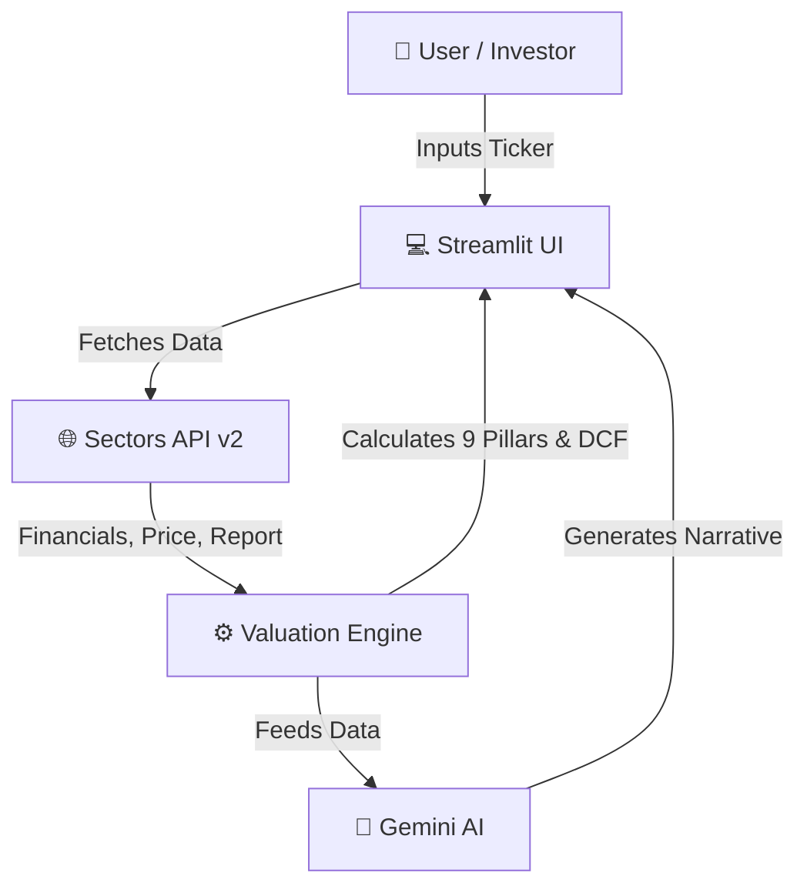

<div align="center">
  
# MAXIMOS
**Intelligent 9-Pillar Value Investing Dashboard**

[](https://python.org)
[](https://streamlit.io)
[](https://sectors.app)
[](https://deepmind.google/technologies/gemini/)

*Elevate your fundamental analysis with deep quantitative insights, discounted cash flows, and AI-powered narratives.*

</div>

---

## 🏗️ Architecture



## ✨ Key Features

| Feature | Description |
| :--- | :--- |
| **🏦 9-Pillar Framework** | Evaluates Profitability, Growth, ROIC, Cashflow, and Debt Health automatically. |
| **🧮 Two-Stage DCF** | Intrinsic value calculation with explicit projection & terminal Gordon Growth. |
| **🛡️ Margin of Safety** | Alerts investors based on Benjamin Graham's strict undervaluation standards. |
| **🤖 AI Analyst Narrative** | Gemini-powered summaries translating raw metrics into actionable insights. |
| **📊 Interactive Charts** | Real-time historical price vs. intrinsic value plots and FCF projections using Plotly. |

## 🚀 Quick Start

Get Maximos running locally in under 2 minutes:

```bash
# 1. Install dependencies
pip install -r requirements.txt

# 2. Setup your API keys in .env
echo "SECTORS_API_KEY=your_key" > .env
echo "GEMINI_API_KEY=your_key" >> .env

# 3. Launch the dashboard
streamlit run app.py
```

## 📂 Detailed Documentation

<details>
<summary>Click to expand for Configuration & Framework Internals</summary>

### Environment Variables
Maximos requires two primary keys to function correctly:
- `SECTORS_API_KEY`: Fetch real-time Indonesian Stock Exchange (IDX) financials.
- `GEMINI_API_KEY`: Generate professional summaries.

### Sector Flexibility
Maximos intelligently adapts its benchmarks. For example, the **Financials/Banking** sector uses specialized thresholds for Debt-to-Equity (up to 8.0x) and treats Enterprise Value directly as Equity Value, automatically bypassing traditional non-bank debt penalties.

### Resilient Architecture
All API requests are aggressively cached using `@st.cache_data(ttl=300)` for 5 minutes, mitigating rate limits, handling transient network errors with exponential backoff, and vastly improving dashboard speed for subsequent ticker re-analyses.

</details>

<div align="center">
  <br>
  <i>Built for the rational investor. Not a recommendation to buy or sell securities.</i>
</div>
